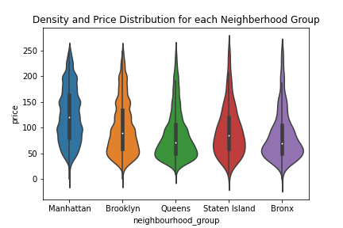
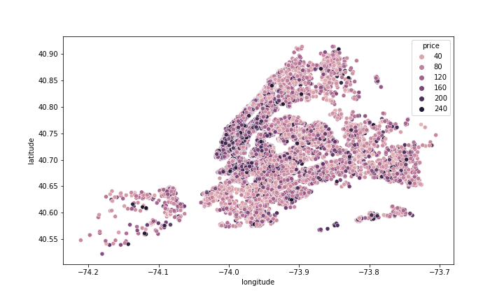
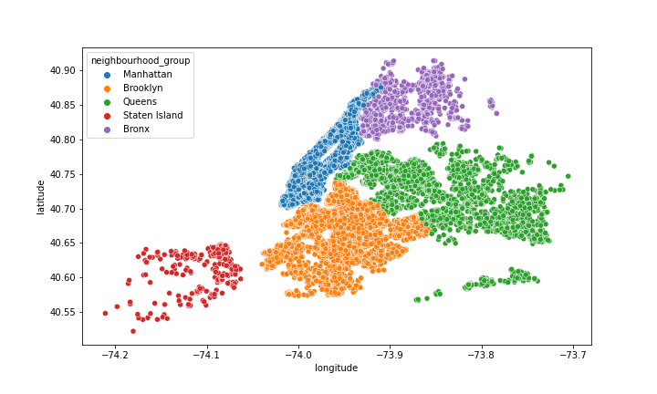
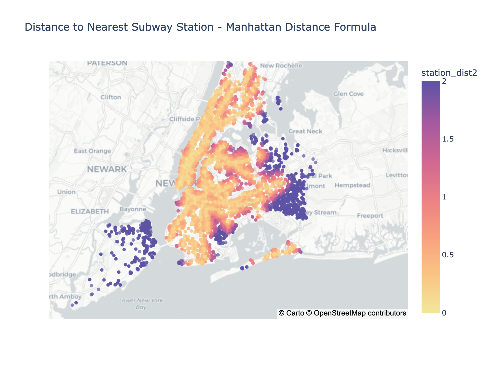

# Airbnb Price Prediction

Final Python Project 

Team: Violet-2

Team Members: 

[Fjollë Gjonbalaj](https://github.com/Fjolle)

[Brendan Ok](https://github.com/brendanok)

[Abby Johnson](https://github.com/johnsonabigail)

[Victor Besse](https://github.com/Victor-Besse)

[Christina Ridlen](https://github.com/csridlen)

[Steven Kim](https://github.com/su1214)

## Introduction

We use a combination of explanatory data analysis, model prediction and machine learning to predict Airbnb rental prices based on 17 key variables including room type and neighbourhood group. We build trained models, including a linear regression and a lasso regression. We compare the performance of models based on the RMSE (the standard deviation of the residuals/prediction errors). 

## Data Collection

The main source of data contains Airbnb data for the city of New York for the year 2021. The data was made available by [Inside Airbnb](http://insideairbnb.com/get-the-data/) and can be found on our [data folder of our repo](https://raw.githubusercontent.com/csridlen/eco395m-project-2/main/data/airbnb_listings_2021.csv).

We also used data published by New York City's various institutions including locations of [subway stations](https://data.cityofnewyork.us/Transportation/Subway-Stations/arq3-7z49) and [parks](https://data.cityofnewyork.us/City-Government/ARCHIVED-Parks-Zones/rjaj-zgq7) as well as neighboorhood areas.

### Data Summary
 
### Data Limitations

### Data Extensions

## Preliminary Analysis: Summary Statistics

We did some preliminary analysis and visualizations in order to better understand our data. Below you can see some of those results:

We created a violin plot to showcase density and distribtuion of prices in different New York City neighbourhoods. We remove extreme values from the price variable by limiting this analysis on prices less than $250. It is clear from the plot that Manhattan has the highest average airbnb price among neighbourhood groups. 

We also show top 5 neighbourhoods by room type based on calculated host listings. It is possible that hosts with more listings charge higher prices. This might be an indicator that more experienced hosts know the market better. This plot shows that Bedford-Stuyvesant has the highest calculated host listings, so we would expect to see higher prices in this neighbourhood group compared to other neighbourhood groups. Further, private rooms have more host listings than entire home/apt in all instances except for Hell's Kitchen. 

We also created a boxplot showing airbnb prices for each neighborhood group based on room type. We can see from the boxplot that Manhattan has the highest airbnb prices among neighbourhood, followed by Brooklyn and Queens. In all instances, entire home/apartments are more expensive than private rooms and shared rooms. 

The heatmap below shows airbnb prices in New York City based on latitute and longitude. 

The second heatmap shows each major neighbourhood group in New York City based on latitute and longitude. 

## Average prices by neighborhood
An issue that we found initially is that the neighborhoods as defined in the Inside Airbnb dataset isn't consistent with the neighborhoods as reported to the Decennial Census and American Community Survey. So we recoded the neighborhoods to the [updated neighborhoods](https://data.cityofnewyork.us/City-Government/2020-Neighborhood-Tabulation-Areas-NTAs-Tabular/9nt8-h7nd) found through the NYC OpenData portal. 

The updated neighborhoods divide up the city into smaller and more groups. Below is a map of average Airbnb Prices grouped by neighborhoods.

 

Refer to [here](https://htmlpreview.github.io/?https://github.com/csridlen/eco395m-project-2/blob/main/artifacts/neighbourhood_price_2021_2.html) to see an interative plot with actual prices per neighborhood.

### Subway station and park zones
We decided to use proximity to subway stations and parks as a predictor in Airbnb prices. For each Airbnb listing, we calculated the distance to the nearest subway and park. We calculated distance using the Manhattan distance formula (Also known as taxicab geomery and named after the borough of course). This distance calculation is different from a traditional distance formula as it's the distance that would be used to for an individual that might drive or walk to a destination rather than distance that would cut through lots and buildings.

Plots below show the distance to the nearest [park](https://htmlpreview.github.io/?https://github.com/csridlen/eco395m-project-2/blob/main/artifacts/nearest_park2.html) and [station](https://htmlpreview.github.io/?https://github.com/csridlen/eco395m-project-2/blob/main/artifacts/nearest_station_2.html). 

## #Data Dictionary 

[airbnb_listings_2021](https://raw.githubusercontent.com/csridlen/eco395m-project-2/main/data/airbnb_listings_2021.csv)

## Database

## Dashboard Creation

## Methodology

### Data Cleaning Process

## Analysis/Findings

Before we perform any predictive models we check for multicollinearity in the data to make sure our coefficients are stable and do not result in high standard errors. Gladly, the VIFs do not indicate that our model has severe multicollinearity as they all are very close to 1. Next, we create train and test data for our linear regression, and check for the model performance based on RMSE, MSE, R2 and adjusted R2. Both the MSE and the RMSE are relatively low. However, the R2 and the adjusted R2 are also low with both an R2 and Adj R2 of 0.243, which indicates that the linear regression does not do a great job at predicting future prices. The results from the regression can be seen in the summary table below: 

In order to draw comparisons, we also build a lasso model. Although lasso is an extension of the linear regression, in general we would expect that the former would perform better than the latter since the former trades an increase in bias for a decrease in variance. To perform this analysis we first create a list of alphas (the parameter which balances the amount of emphasis given to minimizing RSS vs minimizing sum of square of coefficients) to tune. We find the best value of alpha of 0.007. This is very close to zero, so we could expect to receive very similar results/coefficients to the linear regression. In order to visualize the residuals of the lasso model, we plot the residuals against the predicted values. The graph below shows the distribution of these residuals. 

We also plot the lasso errors, 

We then perform feature selection by keeping only the non-zero coefficients in the final model. We see that variables minimum_nights, and room_type are negatively related to the dependent variable price, whereas, variables availability_365, calculated_host_listings_count, neighbourhood and neighbourhood_group are positively related to price. 

With an R2 of 0.245 lasso performs seldom better than the linear model, with an R2 of 0.243. 

## Conclusions

## Reproducability Instructions

## Extensions and Limitations

## Appendix