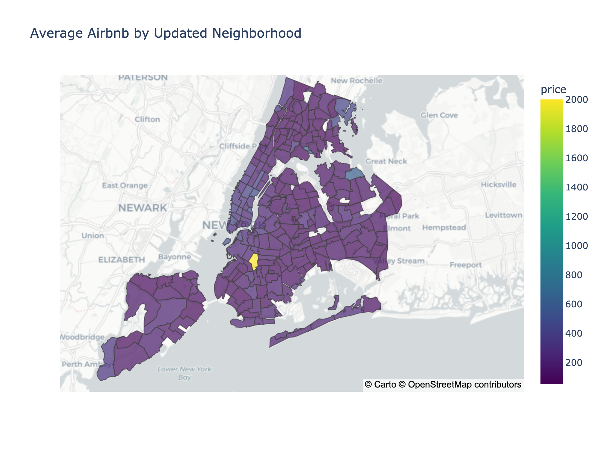

# Airbnb Price Prediction

Final Python Project 

Team: Violet-2

Team Members: 

[Fjollë Gjonbalaj](https://github.com/Fjolle)

[Brendan Ok](https://github.com/brendanok)

[Abby Johnson](https://github.com/johnsonabigail)

[Victor Besse](https://github.com/Victor-Besse)

[Christina Ridlen](https://github.com/csridlen)

[Steven Kim](https://github.com/su1214)

## Introduction

We use a combination of explanatory data analysis, model prediction and machine learning to predict Airbnb rental prices based on 17 key variables including room type and neighbourhood group. We build trained models, including a linear regression and a lasso regression. We compare the performance of models based on the RMSE (the standard deviation of the residuals/prediction errors). 

## Data Collection

The main source of data contains Airbnb data for the city of New York for the year 2021. The data was made available by [Inside Airbnb](http://insideairbnb.com/get-the-data/) and can be found on our [data folder of our repo](https://raw.githubusercontent.com/csridlen/eco395m-project-2/main/data/airbnb_listings_2021.csv).

We also used data published by New York City's various institutions including locations of [subway stations](https://data.cityofnewyork.us/Transportation/Subway-Stations/arq3-7z49) and [parks](https://data.cityofnewyork.us/City-Government/ARCHIVED-Parks-Zones/rjaj-zgq7) as well as neighboorhood areas.

### Data Summary

### Data Limitations

### Data Extensions

## Preliminary Analysis: Summary Statistics

## Average prices by neighborhood
An issue that we found initially is that the neighborhoods as defined in the Inside Airbnb dataset isn't consistent with the neighborhoods as reported to the Decennial Census and American Community Survey. So we recoded the neighborhoods to the [updated neighborhoods](https://data.cityofnewyork.us/City-Government/2020-Neighborhood-Tabulation-Areas-NTAs-Tabular/9nt8-h7nd) found through the NYC OpenData portal. 

The updated neighborhoods divide up the city into smaller and more groups. Below is a map of average Airbnb Prices grouped by neighborhoods.

 

Refer to [here](artifacts/neighbourhood_price_2021_2.html) to see an interative plot with actual prices per neighborhood.

### Subway station and park zones
We decided to use proximiity to subway stations and parks as a predictor in Airbnb prices. For each Airbnb listing, we calculated the distance to the nearest subway and park. We calculated distance using the Manhattan distance formula (Also known as taxicab geomery and named after the borough of course). This distance calculation is different from a traditional distance formula as it's the distance that would be used to for an individual that might drive or walk to a destination rather than distance that would cut through lots and buildings.

Plots below show the distance to the nearest [park](artifacts/nearest_park2/html) and [station](artifacts/nearest_station_2.html). 

 

## #Data Dictionary 

[airbnb_listings_2021](https://raw.githubusercontent.com/csridlen/eco395m-project-2/main/data/airbnb_listings_2021.csv)

## Database

## Dashboard Creation

## Methodology

### Data Cleaning Process

## Analysis/Findings

## Conclusions

## Reproducability Instructions

## Extensions and Limitations

## Appendix

http://insideairbnb.com/get-the-data/
https://www.kaggle.com/datasets/kritikseth/us-airbnb-open-data
- https://github.com/kytola/CleanAirbnb
- https://github.com/edkrueger/eco395m/blob/final-project/projects/final-project.md
- https://wherebnb.herokuapp.com/
- https://github.com/kritikseth/wherebnb

housing data set: https://data.cityofnewyork.us/City-Government/NYC-Citywide-Annualized-Calendar-Sales-Update/w2pb-icbu
